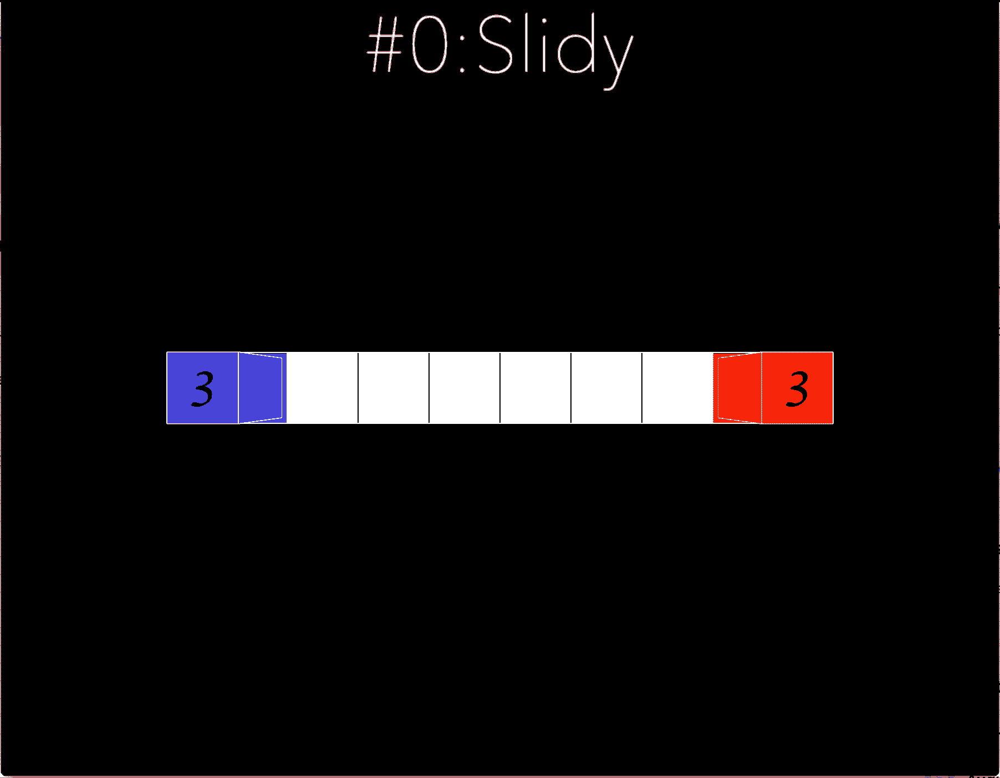

# Objective and Solution of level 0: Slidy

## Objective

Introduce the game and the first rule to player:
```
Move using W S A D and UP DOWN LEFT RIGHT on a keyboard. 

RULE 1
The Count of Amount of your Tile is Accounted
The Amount Counted is always Bounded
```
It teachs player that a block (controled by the player) can move and lay down a set number of tiles. 

No need to say more. 

## Solution



[return to level list](/README.md#level-details/)
