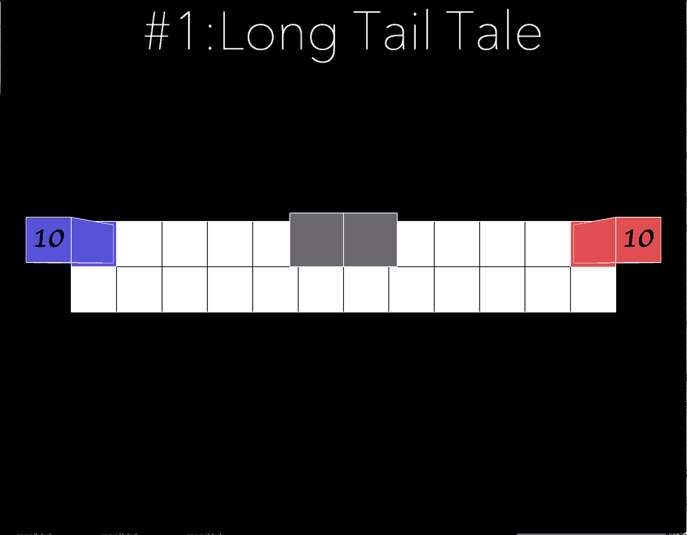

# Objective and Solution of level 1

## Objective
Introduce second rule to the player: 
```
RULE 2
Void while Joint is the Critical Point
Void without Joint ment the Endding Point
Joint without Void ment the Disappoint
```
It teaches player that a Level is complete when two player meet and have spent all their tiles.

## Solution



[return to level list](/README.md#level-details/)
