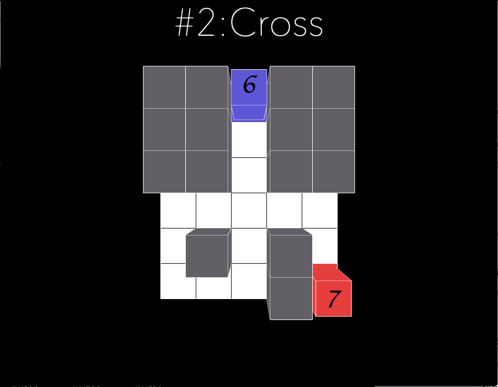

# Objective and Solution of level 2

## Objective
It teaches the player the third rule: 
```
RULE 3
Inlet your Tile is Never Accepted
Retrace the Past of your Friend is a Recommended
```
A block will gain a tile when its past tile is replaced by another player. 

## Solution



[return to level list](/README.md#level-details/)
