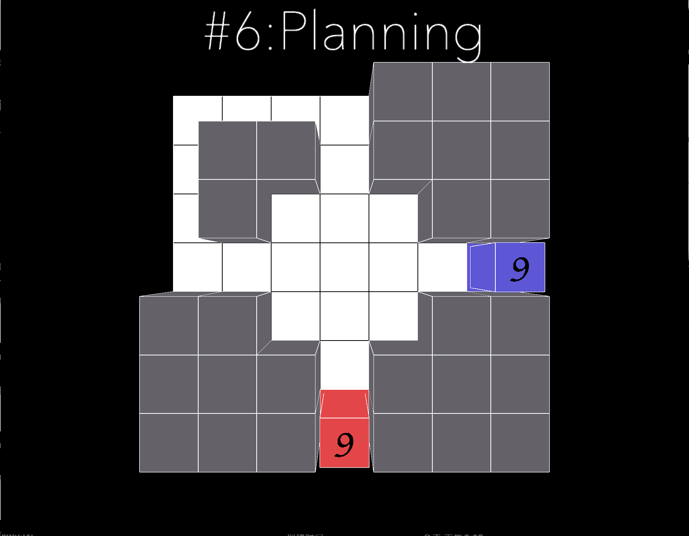

# Objective and Solution of level 6

## Objective

This level reinforces the second rule: 
```
RULE 2
Void while Joint is the Critical Point
Void without Joint ment the Endding Point
Joint without Void ment the Disappoint
```
It encourages player to actively think about their mistake, and lead them to spend extra tile in the center inorder to meet together. 

## Solution



[return to level list](/README.md#level-details/)
