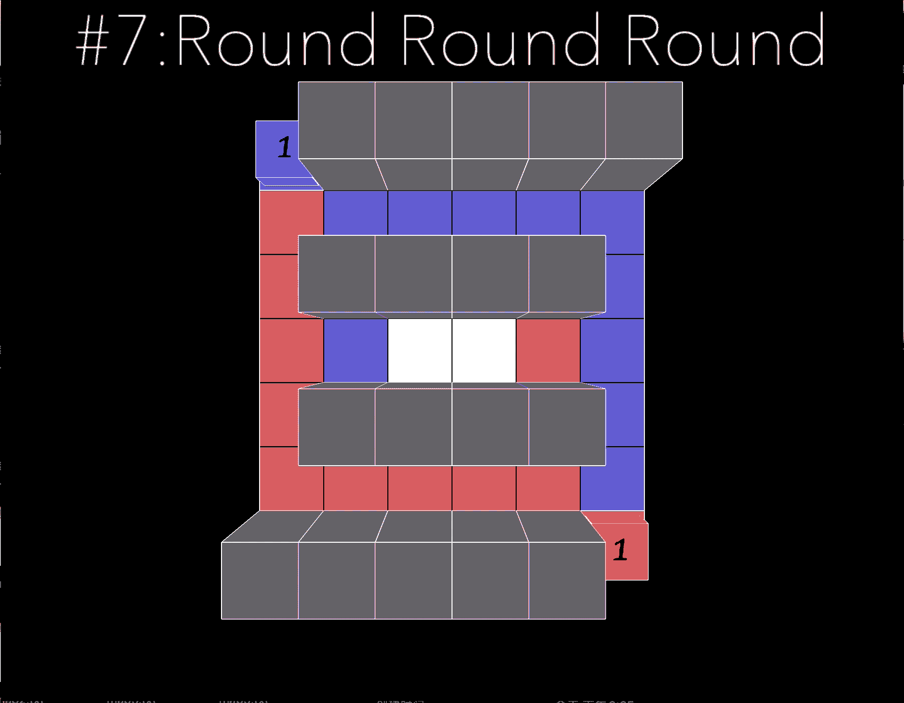

# Objective and Solution of level 7

## Objective

It reinforces rule 3:
```
RULE 3
Inlet your Tile is Never Accepted
Retrace the Past of your Friend is a Recommended
```
A block can step on the other player's tile, but it can never step on itselves tile. 
The only possible solution is to move onto other player's tile. Once one player consumes the tile of the other player, the other player gains one tile and can move on to the first players tile. Cycle repeats until they meet together. 

## Solution



[return to level list](/README.md#level-details/)
