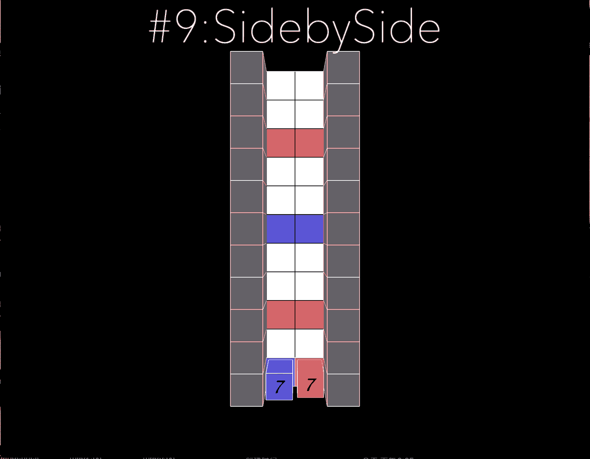

# Objective and Solution of level 9

## Objective

A variation of [Level 8](/documentations/solutions/008.md)

It reinforces rule 3:
```
RULE 3
Inlet your Tile is Never Accepted
Retrace the Past of your Friend is a Recommended
```
A block can step on the other player's tile, but it can never steps on itselves tile. 

Rather than one player leads the way. Players have to alternate on who to break the barrier. 

## Solution



[return to level list](/README.md#level-details/)
