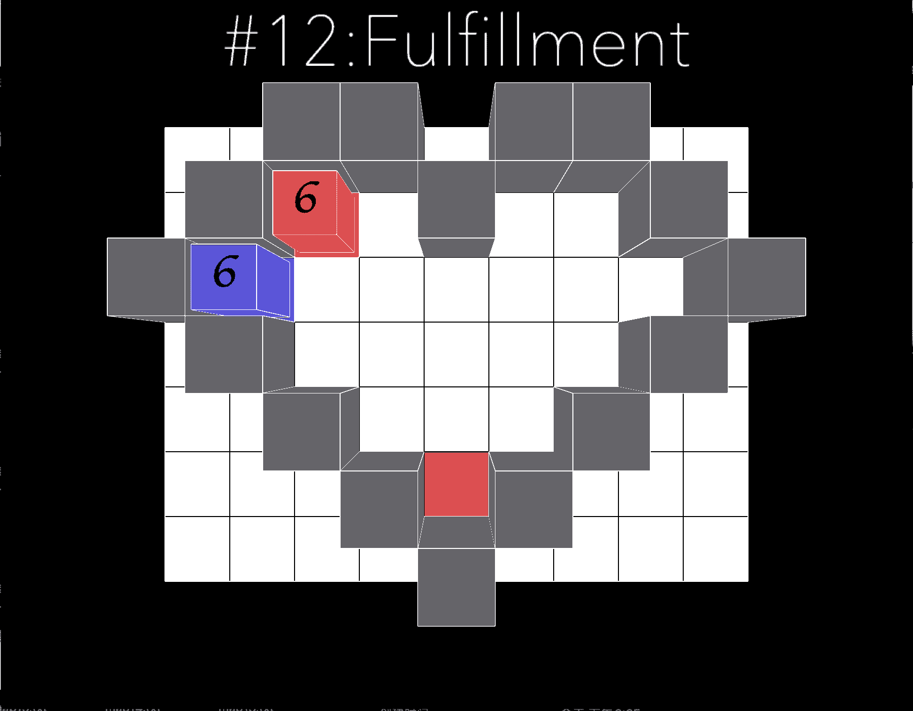

# Objective and Solution of level 12

## Objective

This level have no clear path and no clear solution. Tinker with it and you will solve it eventually.

It let the player to experiment with methods, and actually think on how to solve it. 

The bottom blue tile should be consumed by red block, and the blue comes and release the red block from being stuck. After that, it is just plan tinkering and trial and error. 

## Solution

[return to level list](/README.md#level-details/)
